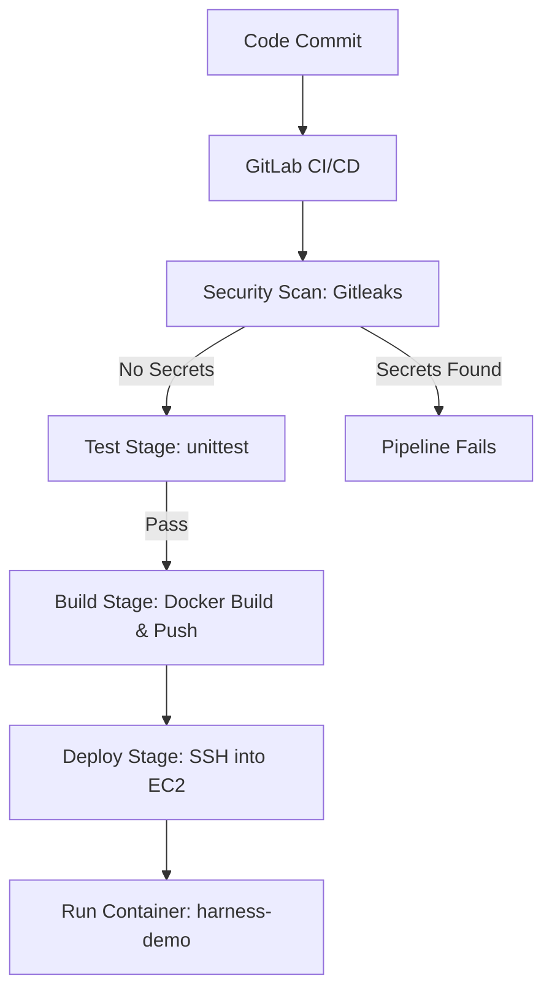

# ⚙️ Harness Demo – CI/CD Pipeline

[](https://github.com/zricethezav/gitleaks)
[](https://gitlab.com/omermd529/harness-demo)

A hands-on DevSecOps project showcasing a **CI/CD pipeline** built with **GitLab CI/CD**, **Docker**, and **AWS EC2**.  
The pipeline automates testing, building, pushing to Docker Hub, and deploying a Flask app on an EC2 instance.

A simple Flask web application that displays an animated rocket with the message "Get Ship Done" - perfect for demonstrating CI/CD pipelines with Harness.

---

## 📌 Project Overview
- **App**: Simple Flask application (`app.py`) with animated CSS rocket and "Get Ship Done" message
- **Features**: 
  - Flask web server serving a single-page application
  - Animated CSS rocket animation
  - Containerized with Docker
  - Kubernetes deployment manifests included
- **Pipeline**: `.gitlab-ci.yml` with 3 stages  
  - ✅ **Test** → Run Python unit tests with `unittest`  
  - 🐳 **Build** → Build Docker image & push to Docker Hub  
  - 🚀 **Deploy** → SSH into AWS EC2, stop old container, run updated container  
- **Infra**: AWS EC2 (Ubuntu) with Docker installed  
- **Registry**: Docker Hub (`omerdevsecops/devsecops-omerops`)  

---

## 🛠️ Pipeline Workflow



---

## 🔧 Tech Stack
- **Backend**: Flask 2.0.2
- **Frontend**: HTML5, CSS3 animations
- **Container**: Docker with Python 3.8 Alpine
- **Orchestration**: Kubernetes
- **CI/CD**: GitLab CI/CD
- **Cloud**: AWS EC2 (Ubuntu)
- **Registry**: Docker Hub
- **Testing**: Python `unittest`
- **Security**: Gitleaks for secret scanning

---

## 📂 Project Structure
```
harness-demo/
├── deploy/
│   ├── app.py              # Flask application
│   ├── requirements.txt    # Python dependencies
│   ├── test_app.py        # Tests
│   ├── static/
│   │   └── style.css      # CSS animations
│   └── templates/
│       └── complete.html  # HTML template
├── Dockerfile             # Container configuration
├── manifest.yaml          # Kubernetes deployment
├── .gitlab-ci.yml         # CI/CD pipeline
└── README.md
```

---

## 🚀 Deployment Steps

### CI/CD Pipeline
1. **Push to GitLab** → Triggers CI/CD  
2. **Security Scan** → Gitleaks scans for secrets (pipeline fails if secrets detected)
3. **Test Stage** → Runs unit tests  
4. **Build Stage** → Builds Docker image & pushes to Docker Hub  
5. **Deploy Stage** → SSH into EC2 → stop old container → run new container

### Local Development
1. Install dependencies:
```bash
cd deploy
pip install -r requirements.txt
```

2. Run the application:
```bash
python app.py
```

3. Open http://localhost:5000 in your browser

### Docker
Build and run with Docker:
```bash
docker build -t harness-demo .
docker run -p 5000:5000 harness-demo
```

### Kubernetes Deployment
Deploy to Kubernetes cluster:
```bash
kubectl apply -f manifest.yaml
```  

---

## 🔐 Security Considerations
- SSH private key stored as **File variable** in GitLab CI/CD  
- Docker Hub credentials stored as **Masked Variables**  
- `chmod 400` applied to private key before use  
- EC2 Security Group allows only required ports  

---

## 📚 Learnings from this Project
- Gained hands-on experience in structuring **multi-stage CI/CD pipelines** (Test → Build → Deploy).  
- Learned how to securely handle **SSH keys** and **Docker Hub credentials** in GitLab CI/CD using **File variables** and **Masked variables**.  
- Practiced deploying applications to **AWS EC2** via automated pipelines instead of manual SSH steps.  
- Understood the importance of applying correct permissions (`chmod 400`) to private keys when using SSH.  
- Automated **container lifecycle management** by stopping/removing old containers before running new ones.  
- Improved skills in combining **Flask app testing (unittest)** with CI/CD to ensure code quality before deployments.  
- Strengthened knowledge of **Docker workflows** — building, tagging, and pushing images to a remote registry.  
- Explored security best practices around **least privilege**, **restricted Security Groups**, and **zero-downtime deployments**.  

---

## 🔮 Next Steps / Future Improvements
- Integrate **GitHub Actions** alongside GitLab CI/CD for multi-platform CI/CD experience.  
- Add **container security scanning** (Trivy, Grype) in the pipeline before pushing images.  
- Implement **Infrastructure as Code (Terraform/Ansible)** for provisioning EC2 and Docker setup automatically.  
- Use **AWS ALB or Nginx reverse proxy** to expose the app on standard ports (80/443) with HTTPS.  
- Deploy app in a **Kubernetes cluster (EKS)** instead of a single EC2 instance for scalability.  
- Add **monitoring and alerting** (CloudWatch, Prometheus, Grafana) to track app uptime and performance.  
- Configure **automated rollback strategy** in case a deployment fails.  
- Extend test coverage with **integration and end-to-end tests**, not just unit tests.  
- Explore **blue-green or rolling deployments** for zero-downtime updates.  

---

## ✅ Status
✔️ Working end-to-end: commit → test → build → deploy to AWS EC2  
🛡️ Secret scanning enabled: **Gitleaks** runs on every push; if any secret is detected, the **pipeline fails and blocks the merge**.

---

## 🔗 Source Code
The complete **source code** and pipeline configuration are hosted on **GitLab**:  
👉 [https://gitlab.com/omermd529/harness-demo](https://gitlab.com/omermd529/harness-demo)  
