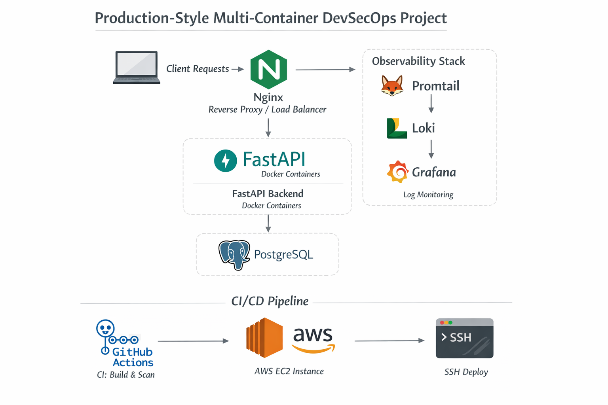

# 🚀 Production-Style Multi-Container DevSecOps Project

This project demonstrates a **production-style containerized application** built using **Docker, FastAPI, Nginx, PostgreSQL**, with **observability, security scanning, CI/CD, and cloud deployment** on AWS EC2.

The focus is on **real-world DevSecOps practices**, not just running containers locally.

---

## 🧱 Architecture Overview

High-level request flow:

```

Client
|
v
Nginx (Reverse Proxy / Load Balancer)
|
v
FastAPI Backend (Docker containers)
|
v
PostgreSQL Database

```

Observability and CI/CD run alongside the application:

- Logs → Promtail → Loki → Grafana
- CI → GitHub Actions
- Security → Trivy
- CD → AWS EC2 (SSH-based deployment)

---

## 🧩 Tech Stack

### Application
- **FastAPI** – Backend API
- **PostgreSQL 15** – Database
- **Nginx** – Reverse proxy & load balancing
- **Docker & Docker Compose**

### Observability
- **Grafana** – Log visualization
- **Loki** – Log storage
- **Promtail** – Log shipper

### DevSecOps
- **GitHub Actions** – CI/CD
- **Trivy** – Container vulnerability scanning
- **AWS EC2** – Deployment target

---

## 📁 Repository Structure

```

Multi-Container-Docker/
├── backend/
│   ├── app/
│   │   └── main.py
│   ├── Dockerfile
│   └── requirements.txt
├── nginx/
│   └── nginx.conf
├── loki/
│   └── loki-config.yml
├── promtail/
│   └── promtail-config.yml
├── docker-compose.yml
├── Readme.md
└── MultiDockerArch.png

```

---

## 🔐 Security Practices Implemented

- Multi-stage Docker builds
- Non-root user in application container
- Dependency vulnerability scanning with **Trivy**
- CI pipeline fails on **HIGH / CRITICAL vulnerabilities**
- Secrets stored in **GitHub Secrets**
- No credentials committed to the repository

---

## 📊 Observability (Centralized Logging)

### Logging Flow

```

Container Logs
↓
Promtail
↓
Loki
↓
Grafana

```

### What’s implemented

- Structured JSON logs from FastAPI
- Nginx access logs
- Centralized log aggregation
- Request-level traceability using request IDs
- Grafana UI for querying logs

### Access (EC2 Deployment)

- **Application:** `http://<EC2_PUBLIC_IP>`
- **Grafana:** `http://<EC2_PUBLIC_IP>:3000`

---

## ⚙️ CI Pipeline (GitHub Actions)

### CI Responsibilities

1. Checkout repository
2. Build FastAPI Docker image
3. Push image to Docker Hub
4. Scan image using **Trivy**
5. Fail pipeline if HIGH / CRITICAL vulnerabilities are found

This ensures **only secure images progress forward**.

---

## 🚀 CD Pipeline (Deploy to AWS EC2)

### Deployment Model

- Single EC2 instance
- Docker Compose used on the VM
- GitHub Actions connects via SSH

### Deployment Flow

```

GitHub Push
↓
GitHub Actions
↓
SSH into EC2
↓
git pull
docker compose pull
docker compose up -d

```

### Result

- Containers are updated automatically
- Existing containers are recreated only if needed
- No manual SSH required after setup

---

## ☁️ Cloud Deployment Details

- **Cloud Provider:** AWS
- **Compute:** EC2 (Amazon Linux)
- **Deployment Tool:** Docker Compose
- **Access:** SSH + Security Groups

A single EC2 instance is intentionally used to:
- Keep architecture simple
- Focus on DevSecOps fundamentals
- Prepare for Kubernetes migration later

---

## 🧠 Key Learnings

- Docker internal DNS and service discovery
- Load balancing without hardcoded IPs
- Centralized logging with zero app coupling
- CI security gates using Trivy
- Real GitHub Actions → EC2 deployment
- Debugging real CI/CD failures (SSH, secrets, permissions)

---

## 🔜 Future Enhancements

- Metrics with **Prometheus**
- Alerting with **Alertmanager**
- Zero-downtime deployments
- CI status badge
- Terraform-based EC2 provisioning
- Kubernetes migration (optional)

---

## 👨‍💻 Author

**Mohammed Omer**  
DevOps / Cloud Engineer  
Focused on Docker, CI/CD, Security, and Cloud-native systems

