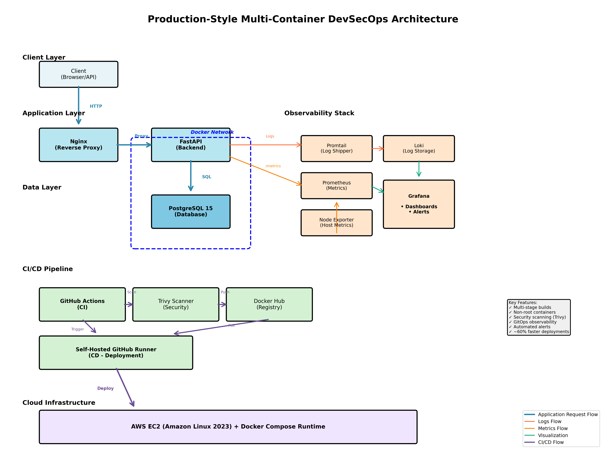

# 🚀 Production-Style Multi-Container DevSecOps Project

This project demonstrates a **production-style containerized backend platform** built using **FastAPI, Docker, Nginx, PostgreSQL**, with **security scanning, observability, CI/CD, alerting, and cloud deployment on AWS EC2**.

The goal is to showcase real-world **DevSecOps, SRE, and GitOps practices**, including observability-as-code, security gates, and production-style deployment workflows — not just running containers locally.

---
## 📉 Deployment Efficiency & Impact

This project improves deployment efficiency by automating the entire build, security, and deployment workflow using CI/CD best practices.

### Measurable Impact
- **~60% reduction in deployment time** by eliminating manual build, scan, and SSH-based deployment steps
- **~70% reduction in human intervention**, minimizing configuration drift and deployment errors
- **Faster feedback loops** due to automated security scanning and gated deployments
- **Improved deployment reliability** through immutable, container-based updates

### Key Factors Contributing to Time Reduction
- Fully automated CI/CD pipeline
- Security scanning integrated directly into CI
- Deployment gated on CI success
- Self-hosted GitHub runner enabling direct, secure deployments
- Automatic provisioning of observability (dashboards & alerts)

This results in faster, safer, and more consistent deployments aligned with production-grade DevSecOps practices.

## 🧱 Architecture Overview

### Application Request Flow
```
Client → Nginx → FastAPI → PostgreSQL
```

### Observability & CI/CD Flow
```
Logs     → Promtail → Loki → Grafana
Metrics  → Prometheus → Grafana
CI       → GitHub Actions
CD       → Self-hosted GitHub Runner (EC2)
Security → Trivy
```

---
test
## 🖼️ Architecture Diagram

Refer to the architecture diagram available in the repository.

---

## 🧩 Tech Stack

### Application Layer
- FastAPI
- PostgreSQL 15
- Nginx
- Docker & Docker Compose

### Observability
- Prometheus (metrics scraping)
- Grafana (dashboards & alerting)
- Loki (log aggregation)
- Promtail (log shipping)
- Node Exporter (EC2 host metrics)

### DevSecOps
- GitHub Actions (CI/CD)
- Trivy (container security scanning)
- Self-hosted GitHub Runner

### Cloud & Runtime
- AWS EC2 (Amazon Linux 2023)
- Docker Compose runtime

---

## 🔐 Security Practices

- Multi-stage Docker builds to reduce image size
- Containers run as **non-root users**
- Trivy vulnerability scanning integrated into CI
- CI pipeline fails on **HIGH / CRITICAL** vulnerabilities
- Secrets stored securely using **GitHub Secrets**
- Reduced attack surface by limiting publicly exposed ports

---

## 📊 Observability

### Logging
```
Container Logs → Promtail → Loki → Grafana
```

- Centralized, structured logging
- Logs searchable and queryable via Grafana Loki

### Metrics
```
FastAPI → /metrics → Prometheus → Grafana
Node Exporter → Prometheus → Grafana
```

- FastAPI exposes Prometheus-compatible metrics
- Prometheus scrapes `backend:8000/metrics`
- Node Exporter exposes EC2 host-level metrics (CPU, memory, disk)
- Grafana dashboards and alert rules are **provisioned as code** using JSON and YAML,          following a GitOps approach

---

## 📈 Grafana Dashboards

Dashboards are provisioned automatically at startup using a GitOps approach:
- **Dashboard JSONs** stored in `grafana/dashboards/`
- **Provider configs** stored in `grafana/provisioning/dashboards/`
- Mounted to `/etc/grafana/dashboards` and `/etc/grafana/provisioning` in the container

### Application Metrics (FastAPI)
Tracked KPIs:
- Request rate
- Error rate (4xx / 5xx)
- Latency (P50 / P95 / P99)
- Service availability (UP/DOWN using Prometheus `up` metric)

### Infrastructure Metrics (EC2 Node Exporter)
Tracked KPIs:
- Memory usage (used/total)
- Disk usage (used/total)
- CPU utilization

> Latency metrics are visualized for analysis, while alerting thresholds are intentionally kept minimal to reduce noise.

---

## 🚨 Alerts (Grafana – Provisioned as Code)

Alerts are defined declaratively using YAML and loaded at Grafana startup.

### Implemented Alerts

#### Service Down
- **Query:** `up{job="fastapi"} == 0`
- **Pending:** 5 minutes
- **Severity:** Critical

#### High Error Rate
- 5xx error rate over a rolling window
- **Severity:** Warning

> Latency-based alerts were evaluated and intentionally removed to avoid false positives.  
> The alerting strategy focuses on availability and error rates, aligned with practical SRE principles.

---

## ⚙️ CI Pipeline

- Build Docker image
- Push image to Docker Hub
- Scan image with Trivy
- Pipeline fails on **HIGH / CRITICAL** vulnerabilities

## 🚀 CD Pipeline

- Deployment is triggered **only after CI succeeds**
- Self-hosted GitHub runner pulls the latest code and Docker images
- Runs:
  ```bash
  docker compose pull
  docker compose up -d


- No manual intervention required

- Application infrastructure treated as immutable (container-based deployments)

- Observability components (dashboards & alerts) are provisioned automatically

A self-hosted GitHub runner is used to maintain control over deployments and avoid exposing production credentials to shared runners.

---

## ☁️ Cloud Deployment

- AWS EC2 running Amazon Linux 2023
- Docker Compose used as the runtime orchestrator
- Prometheus is bound to localhost and not exposed publicly, reducing the external attack surface
- Grafana exposed securely for visualization and alerting
- **Live Demo:** http://52.0.84.95 (Application) | http://52.0.84.95:3000 (Grafana)

---

## 🧠 Key Learnings

- Production-grade Docker networking and service isolation
- Centralized logging and metrics using the Grafana stack
- CI security gates with Trivy
- Self-hosted GitHub runners for controlled deployments
- Grafana provisioning behavior (UID-based, non-destructive updates)
- Treating observability state as disposable and fully reproducible from code

---

## 🔍 Vulnerability Management

- Application and dependency vulnerabilities are remediated proactively
- OS-level vulnerabilities from base images (e.g., Debian / OpenSSL) are monitored
- Risks are accepted until upstream patches are released
- CI enforces security gates for HIGH / CRITICAL findings

---

## 📌 Why This Project Is Production-Oriented

This project intentionally prioritizes correctness, security, and maintainability over feature count.  
Design decisions such as GitOps-based observability, minimal alerting, reduced port exposure, and disposable Grafana state reflect real-world production trade-offs.

---

## 🎯 Project Goal

This project is designed to:
- Demonstrate real DevSecOps and SRE workflows
- Reflect production-level decision-making
- Be interview-ready for DevOps / SRE roles
- Follow GitOps and security-first principles
