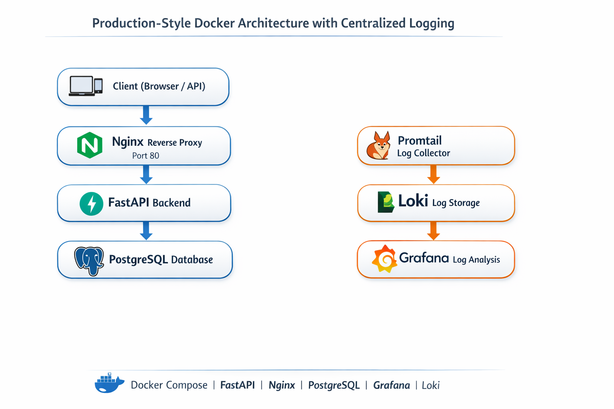

# Multi-Container Docker Application with Observability

## Overview

This project demonstrates a **production-style, multi-container application** built using **Docker Compose**, following DevOps and SRE best practices. It goes beyond simply running containers and focuses on **security, reliability, scalability, and observability**.

The stack includes:

* **FastAPI** – Backend application
* **PostgreSQL** – Persistent relational database
* **Nginx** – Reverse proxy and single entry point
* **Loki** – Centralized log storage
* **Promtail** – Log shipper
* **Grafana** – Log visualization and exploration

---

## Architecture

Client
→ Nginx (Port 80)
→ FastAPI (internal Docker network)
→ PostgreSQL (internal Docker network)

Logs Flow:
Containers → Promtail → Loki → Grafana

---

## Key Features

### 1. Multi-Container Architecture

* Each component runs in its own container
* Services communicate using Docker’s internal DNS
* Only Nginx is exposed to the host

### 2. Secure & Efficient Containers

* Multi-stage Dockerfile for FastAPI
* Non-root user inside application container
* Minimal runtime image size

### 3. Reliability & Self-Healing

* Health checks for PostgreSQL and FastAPI
* Dependency-based startup (`depends_on` with health conditions)
* Automatic restarts using `restart: unless-stopped`

### 4. Reverse Proxy

* Nginx acts as the single entry point
* Backend is never exposed directly

### 5. Centralized Logging (Observability)

* Structured JSON logs from FastAPI
* Promtail tails Docker container log files
* Loki stores logs centrally
* Grafana used to query and correlate logs

### 6. Log Correlation

* Request ID propagated through the application
* Enables tracing a request across services

---

## Project Structure

```
Multi-Container-Docker/
├── backend/
│   ├── Dockerfile
│   ├── requirements.txt
│   └── app/
│       └── main.py
├── nginx/
│   └── nginx.conf
├── loki/
│   └── loki-config.yml
├── promtail/
│   └── promtail-config.yml
├── docker-compose.yml
└── README.md
```

---

## How to Run
You need to have Docker installed on your machine.
```bash
docker compose down -v --remove-orphans
docker compose up --build
```

Services:

* App: [http://localhost](http://localhost)
* Grafana: [http://localhost:3000](http://localhost:3000)

---

## Grafana Usage

1. Login to Grafana (`admin / admin`)
2. Add Loki as a data source (`http://loki:3100`)
3. Explore logs using LogQL:

```logql
{job="docker"}
```

---

## What This Project Demonstrates

* Real-world Docker Compose usage
* Production-style container hardening
* Service health management
* Centralized logging and observability
* Debugging and resolving real infrastructure issues

---

## Future Enhancements

* GitHub Actions CI/CD pipeline
* Prometheus metrics and dashboards
* Security scanning (Trivy, SBOM)
* Rate limiting and TLS at Nginx

---

## Author

**Mohammed Omer**
DevOps / Cloud Engineer

---

This project is intended as a learning-focused but production-aligned reference for modern DevOps practices.
