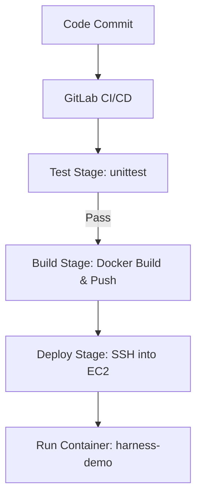

# ⚙️ Harness Demo – CI/CD Pipeline

A hands-on DevSecOps project showcasing a **CI/CD pipeline** built with **GitLab CI/CD**, **Docker**, and **AWS EC2**.  
The pipeline automates testing, building, pushing to Docker Hub, and deploying a Flask app on an EC2 instance.

---

## 📌 Project Overview
- **App**: Simple Flask application (`app.py`) with a unit test (`test_app.py`)
- **Pipeline**: `.gitlab-ci.yml` with 3 stages  
  - ✅ **Test** → Run Python unit tests with `unittest`  
  - 🐳 **Build** → Build Docker image & push to Docker Hub  
  - 🚀 **Deploy** → SSH into AWS EC2, stop old container, run updated container  
- **Infra**: AWS EC2 (Ubuntu) with Docker installed  
- **Registry**: Docker Hub (`omerdevsecops/devsecops-omerops`)  

---

## 🛠️ Pipeline Workflow



---

## 🔧 Tech Stack
- **Languages**: Python (Flask)
- **Containerization**: Docker
- **CI/CD**: GitLab CI/CD
- **Cloud**: AWS EC2 (Ubuntu)
- **Registry**: Docker Hub
- **Testing**: Python `unittest`

---

## 📂 Project Structure
```
harness-demo-cicd/
│── app.py               # Flask app
│── test_app.py          # Unit test (unittest)
│── Dockerfile           # Containerization
│── requirements.txt     # Dependencies
│── .gitlab-ci.yml       # CI/CD pipeline
│── README.md            # Project documentation
```

---

## 🚀 Deployment Steps
1. **Push to GitLab** → Triggers CI/CD  
2. **Test Stage** → Runs unit tests  
3. **Build Stage** → Builds Docker image & pushes to Docker Hub  
4. **Deploy Stage** → SSH into EC2 → stop old container → run new container  

---

## 🔐 Security Considerations
- SSH private key stored as **File variable** in GitLab CI/CD  
- Docker Hub credentials stored as **Masked Variables**  
- `chmod 400` applied to private key before use  
- EC2 Security Group allows only required ports  

---

## 📚 Learnings from this Project
- Gained hands-on experience in structuring **multi-stage CI/CD pipelines** (Test → Build → Deploy).  
- Learned how to securely handle **SSH keys** and **Docker Hub credentials** in GitLab CI/CD using **File variables** and **Masked variables**.  
- Practiced deploying applications to **AWS EC2** via automated pipelines instead of manual SSH steps.  
- Understood the importance of applying correct permissions (`chmod 400`) to private keys when using SSH.  
- Automated **container lifecycle management** by stopping/removing old containers before running new ones.  
- Improved skills in combining **Flask app testing (unittest)** with CI/CD to ensure code quality before deployments.  
- Strengthened knowledge of **Docker workflows** — building, tagging, and pushing images to a remote registry.  
- Explored security best practices around **least privilege**, **restricted Security Groups**, and **zero-downtime deployments**.  

---

## 🔮 Next Steps / Future Improvements
- Integrate **GitHub Actions** alongside GitLab CI/CD for multi-platform CI/CD experience.  
- Add **container security scanning** (Trivy, Grype) in the pipeline before pushing images.  
- Implement **Infrastructure as Code (Terraform/Ansible)** for provisioning EC2 and Docker setup automatically.  
- Use **AWS ALB or Nginx reverse proxy** to expose the app on standard ports (80/443) with HTTPS.  
- Deploy app in a **Kubernetes cluster (EKS)** instead of a single EC2 instance for scalability.  
- Add **monitoring and alerting** (CloudWatch, Prometheus, Grafana) to track app uptime and performance.  
- Configure **automated rollback strategy** in case a deployment fails.  
- Extend test coverage with **integration and end-to-end tests**, not just unit tests.  
- Explore **blue-green or rolling deployments** for zero-downtime updates.  

---

## ✅ Status
✔️ Working end-to-end: commit → test → build → deploy to AWS EC2  
